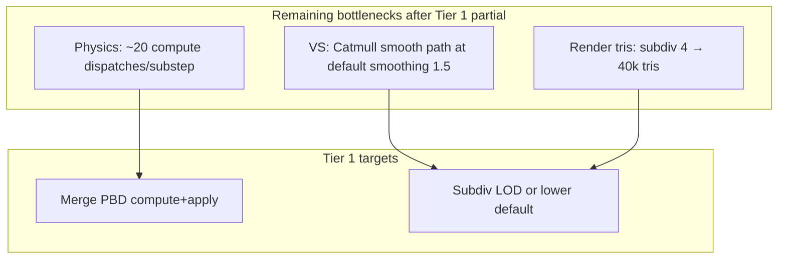

# LaveryClothPhysics — Optimization Backlog

Tier 0 quick wins are **done** (see git history). This file tracks remaining work from the performance audit.

---

## Completed — Tier 0

| ID | Task | Status |
|----|------|--------|
| 0.1 | Deduplicate VS normal/tangent — single `emitSurfaceVaryings()` pass | Done |
| 0.2 | Default `selfCollision: true` (toggle remains in GUI) | Done |
| 0.3 | Stop loading unused `height.png` for denim runtime | Done |
| 0.4 | Remove duplicate `enforcePins` at substep start (keep end only) | Done |
| 0.5 | Enable `frustumCulled` with conservative bounding sphere | Done |

---

## Completed — Tier 1 (partial)

| ID | Task | Status | Notes |
|----|------|--------|-------|
| 1.1 | **Merge compute kernels** | Partial | Merged substep/finalize/contact passes (~5 fewer dispatches/substep). PBD compute+apply fusion reverted — nested TSL `Fn` broke constraint accumulation. |
| 1.2 | **Bilinear `sampleSimPosition` for render** | Done | Catmull/smooth path only when `renderGeometrySmoothing > 1`. |
| 1.4 | **Spatial grid for self-collision** | Done | Skip grid neighbors (`>2`), repulse fold pairs via TSL `select`+`addAssign` (nested `If` breaks accumulation). |

**Also shipped:** Reset flag button (overlay + GUI), `resetFlag()` GPU kernel.

---

## Tier 1 — Remaining

| ID | Task | Expected Win | Files / Notes |
|----|------|--------------|---------------|
| 1.3 | **Render subdiv LOD** — high subdiv near camera, low subdiv far | Scales with distance | Distance uniform + mesh rebuild or shader LOD |

### Tier 1 — Acceptance Criteria

- [ ] Smoke test passes (`npm run test:smoke`)
- [ ] No regression in flag denim visibility (both sides lit)
- [ ] Profile before/after on M-series Mac or discrete GPU (optional: WebGPU timestamp queries)

---

## Tier 2 — Architecture (Production Grade)

| ID | Task | Expected Win | Notes |
|----|------|--------------|-------|
| 2.1 | **Align sim/render resolution** — 1 render vert per sim particle, tessellate in VS | Align physics/render cost | WebGPU has no geometry shader; VS tessellation or mesh shaders |
| 2.2 | **Decouple sim rate from display** — sim 120 Hz + interpolation buffer | ~3× less physics | Acceptable for flag; interpolate positions for render |
| 2.3 | **Dual-shell mesh** — front/back shells, `FrontSide` each | Best double-sided quality | 2× tris; fixes back-face without `DoubleSide` hacks |
| 2.4 | **Async readback ring buffer** for health stats | Smoother frame times | PBO triple-buffer; never stall render for `getArrayBufferAsync` |
| 2.5 | **Cache TSL material graph** on subdiv-only rebuild | Faster GUI rebuilds | Reuse graph when only geometry changes |

---

## Tier 3 — Shipping & Tooling

| ID | Task | Why |
|----|------|-----|
| 3.1 | Delete legacy `FlagSimulation.ts`, `FlagControls.ts`, `FlagSettings.ts` | ~780 lines dead code |
| 3.2 | KTX2/Basis compress denim textures | ~1.1 MB → ~200 KB load |
| 3.3 | Dynamic import for `?mode=plane` debug | Trim main prod bundle |
| 3.4 | Playwright headless in CI; headed optional locally | Faster CI; 7 serial GPU tests are expensive |
| 3.5 | Add `npm run typecheck` + bundle visualizer | Catch regressions early |
| 3.6 | Wire `height.png` only when parallax/displacement is implemented | Avoid re-loading without use |

---

## Reference — Hot Path Summary

### Complexity at defaults (49×26, subdiv 4, self-collision on)

| Metric | Value |
|--------|-------|
| Sim particles | 1,350 |
| Render verts | 20,685 |
| Render tris | 40,768 |
| Compute dispatches/substep (approx) | ~20 |
| Self-collision pair checks/substep | ~108k (1350 × 80 neighbors) |

---

## Suggested Sprint Order

1. **1.3** Render subdiv LOD
2. **3.1** Delete legacy sim

---

## Do Not Optimize Yet

- PMREM / RoomEnvironment (runs once at init)
- lil-gui (negligible vs GPU)
- ACES tone mapping
- Procedural 256² normal map singleton

---

*Last updated: Tier 1 partial pass (self-collision grid, kernel merge, reset flag).*
