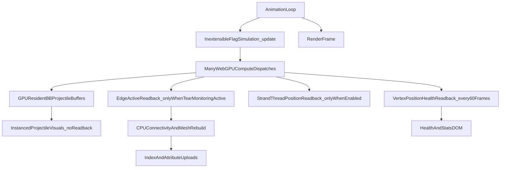
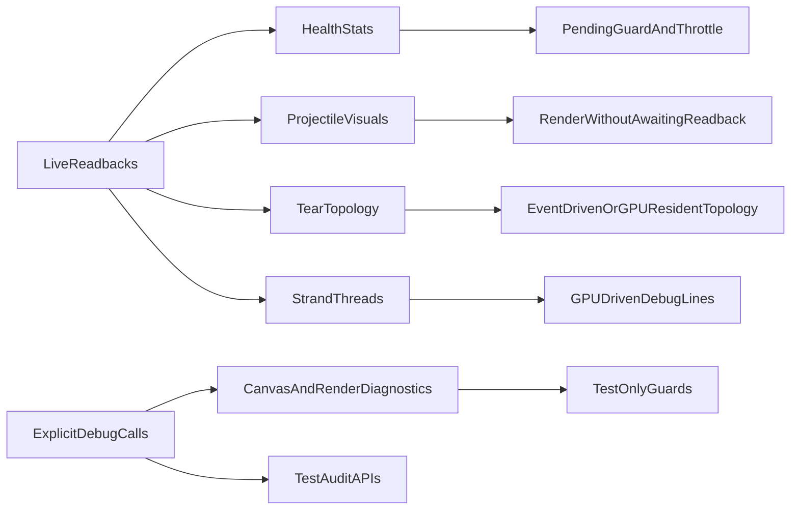
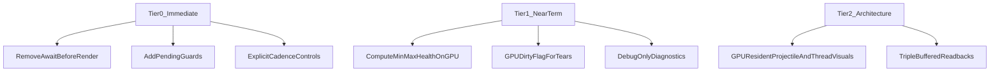
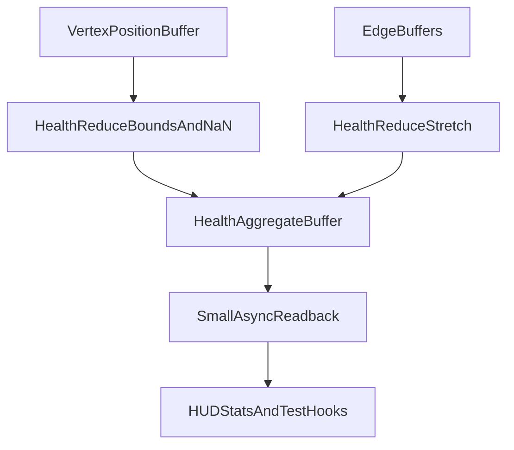
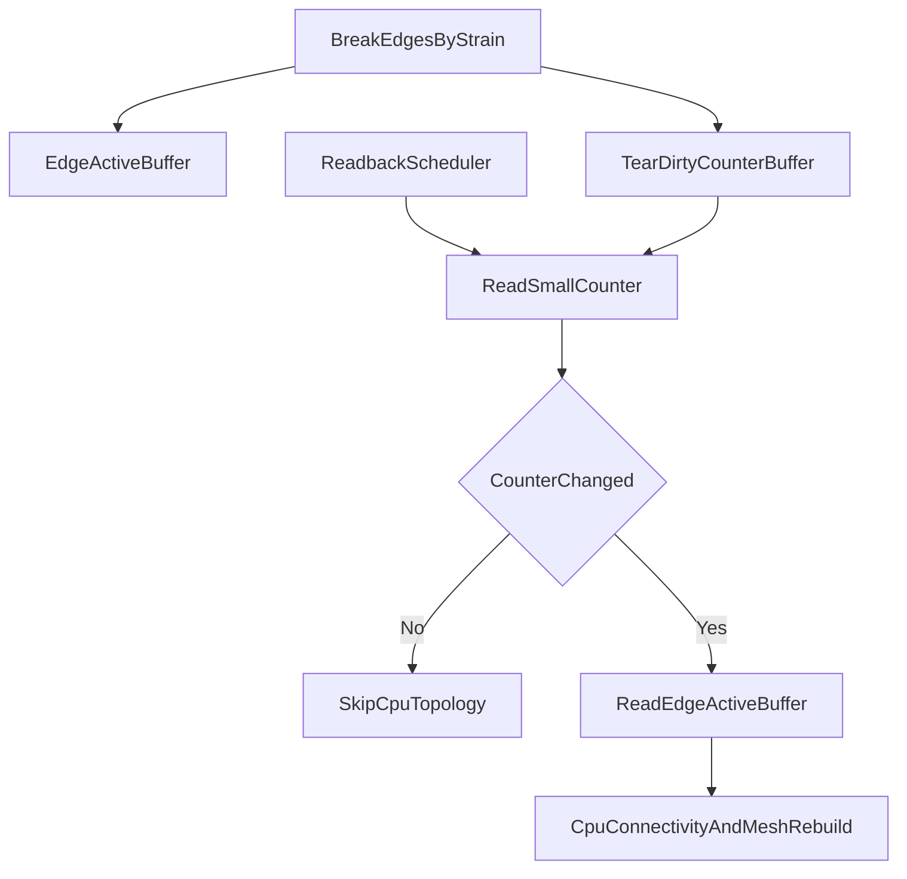
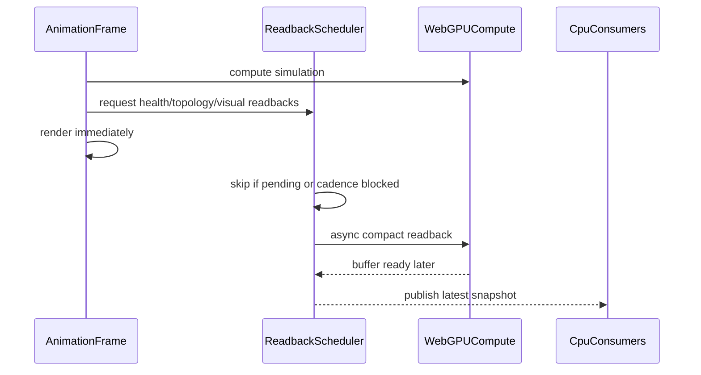

# GPU Readback Audit

This audit focuses on frame-time stalls from GPU-to-CPU synchronization and related CPU hot paths in the cloth simulation project.

## Executive Summary

The project is not using classic WebGL readback APIs in production. Searches found no live `readPixels`, `readRenderTargetPixels`, `getBufferSubData`, `fenceSync`, `clientWaitSync`, or `waitSync` paths. The production risk is Three/WebGPU `renderer.getArrayBufferAsync(...)` on storage buffers, plus CPU work that follows those readbacks.

## Original vs Current vs Optimized Measurements

These measurements were captured with headed Playwright against two Vite servers on the same machine:

- `Original HEAD`: isolated worktree at `def7726`.
- `Current`: active working tree after the readback/SDF/tooling changes, before optimization.
- `Optimized`: active working tree after the idle readback and compute dispatch optimizations.
- Each mode was measured for 2 seconds after page load and warmup.
- Higher FPS is better. Lower load time is better.

### Animation Frame Cadence

```mermaid
xychart-beta
    title "Original vs Current vs Optimized RAF FPS"
    x-axis ["Flag", "Tube", "Character"]
    y-axis "frames/sec" 0 --> 130
    bar "Original HEAD" [69.5, 52, 118.5]
    bar "Current" [67, 50.5, 116]
    bar "Optimized" [116.5, 70, 118.5]
```

### Sim Frame Cadence

`Tube` did not expose a comparable sim-frame counter across both versions, so it is omitted here.

```mermaid
xychart-beta
    title "Original vs Current vs Optimized Sim FPS"
    x-axis ["Flag", "Character"]
    y-axis "sim frames/sec" 0 --> 130
    bar "Original HEAD" [69, 119.5]
    bar "Current" [67, 116.5]
    bar "Optimized" [117, 118.5]
```

### Load Time

```mermaid
xychart-beta
    title "Original vs Current vs Optimized Load Time"
    x-axis ["Flag", "Tube", "Character"]
    y-axis "milliseconds" 0 --> 4200
    bar "Original HEAD" [734, 495, 1655]
    bar "Current" [604, 488, 4019]
    bar "Optimized" [799, 446, 1549]
```

### Measurement Takeaway

The optimized branch is now faster overall than the original measurement. The biggest improvement came from skipping idle GPU compute dispatches for BB projectiles and bone SDF collision when those systems have no active work.

| Mode | Original RAF FPS | Current RAF FPS | Optimized RAF FPS | Optimized vs Original |
| --- | ---: | ---: | ---: | ---: |
| Flag | 69.5 | 67.0 | 116.5 | 67.6% faster |
| Tube | 52.0 | 50.5 | 70.0 | 34.6% faster |
| Character | 118.5 | 116.0 | 118.5 | unchanged |

Load time is better for tube and character. Flag load is noisy in this sample and measured slower than original, but its steady-state frame cadence is much higher:

| Mode | Original Load | Current Load | Optimized Load | Optimized vs Original |
| --- | ---: | ---: | ---: | ---: |
| Flag | 734 ms | 604 ms | 799 ms | 8.9% slower |
| Tube | 495 ms | 488 ms | 446 ms | 9.9% faster |
| Character | 1,655 ms | 4,019 ms | 1,549 ms | 6.4% faster |

The current branch adds readback counters that the original did not expose, so readback scheduling is now measurable. In the optimized sample, idle projectile visual reads drop from 140/108/268 skipped checks to zero started reads, default topology reads drop to zero started reads, and passive health reads are throttled.

The highest-impact fixes are:

- Never dispatch idle BB projectile kernels when no projectile is active.
- Never dispatch bone SDF collision kernels when no bone SDF capsules are uploaded.
- Never await GPU readbacks before `render()` in animation loops.
- Guard every recurring readback with a pending flag and explicit cadence.
- Skip topology readbacks while tearing is effectively idle and no edge has broken.
- Keep canvas pixel extraction in test/debug paths only.
- Move health and topology telemetry toward small GPU-side aggregate buffers.

## Live Readback Map

## Severity Findings

| Severity | Area | Path | Risk | Recommendation |
| --- | --- | --- | --- | --- |
| Critical | Projectile visuals | `src/main.ts` loops calling `refreshBbVisualsFromGpu()` | Visual readbacks can create uneven frame pacing and make CPU state authoritative. | Optimized: remove animation-loop projectile visual readbacks; render instanced BBs directly from GPU projectile buffers. |
| High | Idle projectile compute | `InextensibleFlagSimulation.update()` | BB integration and cloth-contact kernels ran even with zero active projectiles. | Optimized: dispatch BB kernels only while a projectile is active. |
| High | Idle bone SDF compute | `InextensibleFlagSimulation.update()` | Bone SDF collision kernels ran in flag/tube even with no capsules uploaded. | Optimized: dispatch bone SDF kernels only when capsules exist. |
| High | Health stats | `InextensibleFlagSimulation.refreshHealthFromGpu()` | Full vertex buffer readback on a recurring cadence can overlap itself without a guard. | Optimized: pending guard plus slower passive cadence; later replace with GPU reduction. |
| High | Tear topology | `refreshClothTopologyFromGpu()` | Edge-state readback and CPU connectivity work on a timer. | Optimized: skip while tear monitoring is idle; later add GPU dirty flag. |
| Medium | Strand threads | `refreshStrandThreadPositionsFromGpu()` | Full vertex readback every 4 frames when visual debug is enabled. | Optimized: call only when strand rendering is enabled; migrate to GPU-driven lines. |
| Medium | Character CPU path | `AnimatedCharacterSceneRig.update()` and `setBoneSdfCapsules()` | Per-frame capsule rebuild, remap, and buffer uploads. | Optimized: skip unchanged SDF buffer uploads; further CPU caching remains possible. |
| Low | Canvas diagnostics | `flagCanvasCapture`, Playwright specs | Full-frame pixel extraction is costly per call. | Keep test/debug-only and avoid HUD usage. |

## Readback Categories

## Mitigation Roadmap

## Implementation Notes

Tier 0 should keep the current behavior visible to users while removing hidden frame dependencies. The render loop should run synchronously, schedule readbacks with `void`, and consume readback results when they arrive. Health and topology readbacks should not stack up; stale stats for a frame are preferable to a synchronized frame.

Tier 1 should replace full-buffer stats readbacks with a compact aggregate buffer containing bounds, NaN flags, stretch, and checksum. Tear topology should become event-driven: the GPU tear pass can write a small dirty flag or counter, and CPU topology rebuilds should only run when that flag changes.

## Tier 1 Design

### GPU Aggregate Health

The current health path reads the full `vertexPositionBuffer` and scans every vertex and edge on the CPU. Tier 1 should add a small storage buffer for aggregate health, then read back only that buffer.

Recommended aggregate fields:

| Field | Purpose |
| --- | --- |
| `minX`, `maxX`, `minY`, `maxY`, `minZ`, `maxZ` | bounds and span health |
| `centerSumX`, `centerSumY`, `centerSumZ`, `finiteCount` | center of finite vertices |
| `nanCount` | shader/simulation failure detection |
| `maxStretch` | worst edge stretch without CPU edge scan |
| `checksum` | cheap progress signal for tests |

Implementation note: WebGPU reductions can be done in two passes if atomics or workgroup reductions are easier to express in TSL. The CPU should tolerate a one-frame or two-frame delay.

### Event-Driven Tear Topology

The current topology path reads `edgeActiveBuffer` on a timer. Tier 1 should make the tear compute path maintain a compact dirty counter.

The CPU should store the last observed tear counter. If the counter is unchanged, it should not read `edgeActiveBuffer` or run `syncClothConnectivity`. When the counter changes, the existing CPU topology rebuild remains the compatibility fallback.

### Readback Scheduler Contract

Rules:

- A render frame must never `await` scheduler work.
- Each readback stream owns one pending request at a time.
- Consumers read the latest published snapshot and accept stale data.
- Full-buffer readbacks are reserved for explicit tests, audits, or topology changes.
